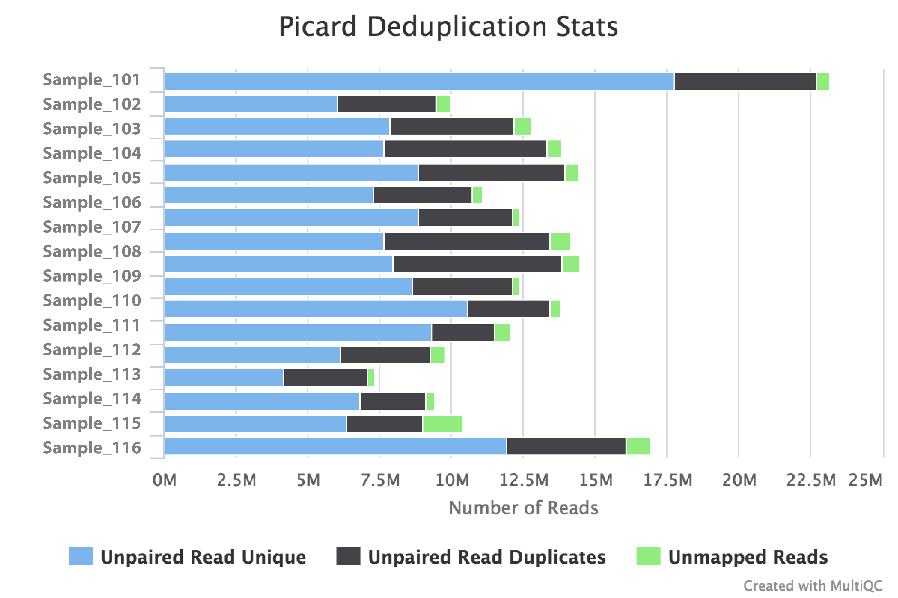

# nf-core/wgsalign Output

**nf-core/wgsalign** is a pipeline for basic preprocessing of WGS data.

This document describes the output produced by the pipeline.

## Pipeline overview:
The pipeline is built using [Nextflow](https://www.nextflow.io/)
and processes data using the following steps:

* [FastQC](#fastqc) - read quality control
* [TrimGalore](#trimgalore) - adapter trimming
* [BWA](#bwa) - alignment
* [SAMtools](#samtools) - alignment result processing
* [Bedtools](#bedtools) - bam to bed file conversion
* [Picard](#picard) - duplicate reads removal
* [MultiQC](#multiqc) - aggregate report, describing results of the whole pipeline

## FastQC
[FastQC](http://www.bioinformatics.babraham.ac.uk/projects/fastqc/) gives general quality metrics about your reads. It provides information about the quality score distribution across your reads, the per base sequence content (%T/A/G/C). You get information about adapter contamination and other overrepresented sequences.

For further reading and documentation see the [FastQC help](http://www.bioinformatics.babraham.ac.uk/projects/fastqc/Help/).

> **NB:** The FastQC plots displayed in the MultiQC report shows _untrimmed_ reads. They may contain adapter sequence and potentially regions with low quality. To see how your reads look after trimming, look at the FastQC reports in the `trim_galore` directory.

**Output directory: `results/fastqc`**

* `sample_fastqc.html`
  * FastQC report, containing quality metrics for your untrimmed raw fastq files
* `sample_fastqc.zip`
  * zip file containing the FastQC report, tab-delimited data file and plot images

## TrimGalore
[TrimGalore](http://www.bioinformatics.babraham.ac.uk/projects/trim_galore/) is used for removal of adapter contamination and trimming of low quality regions. TrimGalore uses [Cutadapt](https://github.com/marcelm/cutadapt) for adapter trimming and runs FastQC after it finishes.

MultiQC reports the percentage of bases removed by TrimGalore in the _General Statistics_ table, along with a line plot showing where reads were trimmed.

**Output directory: `results/trimgalore`**

Contains FastQ files with quality and adapter trimmed reads for each sample, along with a log file describing the trimming.

* `sample_val_1.fq.gz`, `sample_val_2.fq.gz`
  * Trimmed FastQ data, reads 1 and 2.
* `sample_val_1.fastq.gz_trimming_report.txt`
  * Trimming report (describes which parameters that were used)
* `sample_val_1_fastqc.html`
* `sample_val_1_fastqc.zip`
  * FastQC report for trimmed reads

Single-end data will have slightly different file names and only one FastQ file per sample:
* `sample_trimmed.fq.gz`
  * Trimmed FastQ data
* `sample.fastq.gz_trimming_report.txt`
  * Trimming report (describes which parameters that were used)
* `sample_trimmed_fastqc.html`
* `sample_trimmed_fastqc.zip`
  * FastQC report for trimmed reads

## BWA
[BWA](http://bio-bwa.sourceforge.net/), or Burrows-Wheeler Aligner, is designed for mapping low-divergent sequence reads against reference genomes. The result alignment files are further processed with [SAMtools](http://samtools.sourceforge.net/) and [Bedtools](http://bedtools.readthedocs.io/en/latest/).

**Output directory: `results/bwa`**

* `sample.sorted.bam`
  * The sorted aligned BAM file
* `sample.sorted.bam.bai`
  * The index file for aligned BAM file
* `sample.sorted.bed`
  * The sorted aligned BED file

## Picard
The [MarkDuplicates](https://broadinstitute.github.io/picard/command-line-overview.html#MarkDuplicates) module in the [Picard](https://broadinstitute.github.io/picard/) toolkit differentiates the primary and duplicate reads using an algorithm that ranks reads by the sums of their base-quality scores, which helps to identify duplicates that arise during sample preparation e.g. library construction using PCR.

The Picard section of the MultiQC report shows a bar plot with the numbers and proportions of primary reads, duplicate reads and unmapped reads.

**Output directory: `results/picard`**

* `sample.dedup.sorted.bam`
  * The sorted aligned BAM file after duplicate removal
* `sample.dedup.sorted.bam.bai`
  * The index file for aligned BAM file after duplicate removal
* `sample.dedup.sorted.bed`
  * The sorted aligned BED file after duplicate removal
* `sample.picardDupMetrics.txt`
  * The log report for duplicate removal

## MultiQC
[MultiQC](http://multiqc.info) is a visualisation tool that generates a single HTML report summarising all samples in your project. Most of the pipeline QC results are visualised in the report and further statistics are available in within the report data directory.

**Output directory: `results/MultiQC`**

* `multiqc_report.html`
  * MultiQC report - a standalone HTML file that can be viewed in your web browser
* `multiqc_data/`
  * Directory containing parsed statistics from the different tools used in the pipeline

For more information about how to use MultiQC reports, see http://multiqc.info
